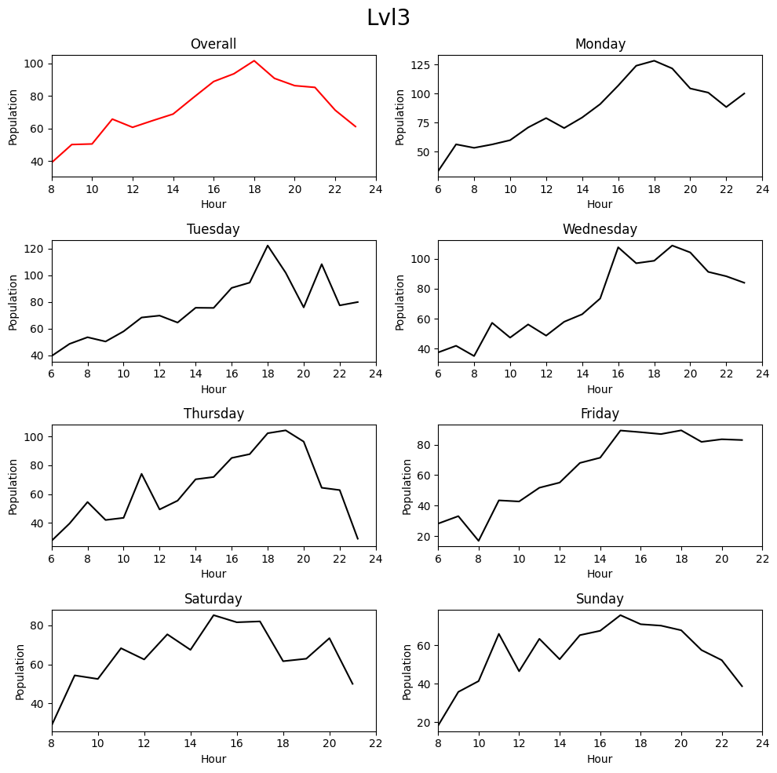

# Nicholas Recreation Center Population Tracker
A python application, automated by AWS, that scrapes data, analyzes it, and sends a weekly report on the status of the gym busyness.
## Purpose
The goal is to determine the best times to go to the Nicholas Recreation Center (UW Madison's campus gym). They provide a [live usage tracker website](https://recwell.wisc.edu/liveusage/) that they update roughly every hour, however it only displays current population data. To make educated decisions on when to go to the gym, I want to collect a history of the data so that I can analyze micro and macro patterns. 
## Description
### Scraping the data
The main tools that I used to retrieve the data from the website were the python libraries BeautifulSoup4 and requests. One of the main obstacles of scraping data from this website was its dynamic nature. If I sent a simple request to the link, I would get back an HTML block, but the values would all be default (0). I explored scraping with automated browser tools such as Selenium and Pupeteer, but eventually settled on a more grounded solution. By inspecting the webpage we can determine where this data is coming from and make a direct request to this new source. This also makes the application faster since the program doesn't have to boot up an entire browser every time it runs. It also makes the project easier to deploy and more lightweight (chromium is a large file).
### Storing the data
The data is then extracted from the request using BeautifulSoup. It is immediately exported to a MySQL database. The database information is stored in a [config.json](config-sample.json) file and needs to be configured to the database. 
### Automating this process
Using Docker and the AWS/Python3.9 base image, the application is exported to AWS and stored in its Elastic Container Registry. The MySQL database is hosted by its Relational Database Service (RDS). The main program is [DataGatherer.py](DataGatherer.py) and is automatically run in AWS Lambda. The Lambda function runs the pushed container every 30 minutes, appending the newly scraped data to the MySQL RDS database.
### Analysis
The entirety of the analysis is found in the Jupyter Notebook [DataAnalyzer.ipynb](DataAnalyzer.ipynb). I used PyMySQL to retrieve the data from the database in the form of a tuple. I then converted this to a Pandas DataFrame. I implemented various functions to clean the data, such as removing duplicates. After that, I created a new DataFrame that contained the average population for each hour. I built a function that plots these averages 8 times (the overall averages and 1 for each day of the week) using Matplotlib. 

I also analyzed weekly trends. I partitioned the main DataFrame into smaller DataFrames representing individual weeks. Then, the average population of each smaller DataFrame was plotted.

## Results
All the different floors have very similar results. The gym population reaches a peak at about 6:00. Based on my experience and opinions, this data shows that any time between 2:00-4:00 is a reasonable time to go. I belive that any time before 2:00 is the ideal time to go to the gym.

I also noticed a steep increase in gym attendance following Winter break. There is a lack of data during the start of the first semester, so it is uncertain whether this spike is something that predictably happens at the beginning of each semester or if it is a general trend related to something else.
## Status
UW Madison is currently building another facility. It is set to be finished in the next few months. When it is finished, I will begin collecting data from that location and also monitor how it affects the usage of the Nich.

In the future, I have plans to add a feature for automatically producing a weekly report (likely in pdf format).